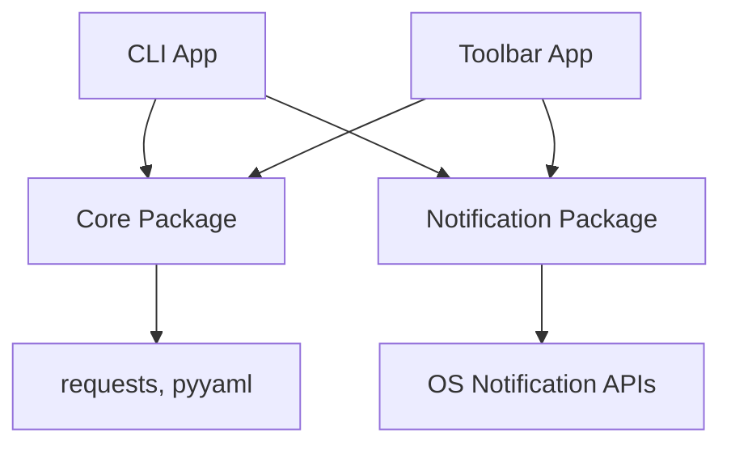

# 🏔 DNT Watcher

> Multi-layered cabin availability monitoring system with CLI, macOS menu bar app, and modular architecture!

[](https://www.python.org/downloads/)
[](https://opensource.org/licenses/MIT)
[](https://docs.astral.sh/uv/)
[](tests/)

## ✨ Features

- 🏗️ **Modern Architecture**: UV Workspace with separated concerns (core, CLI, notification, toolbar)
- 🎯 **Weekend-Focused**: Automatically detects full Friday-Sunday weekends
- 🎨 **Beautiful CLI**: Colorful terminal output highlighting what matters most
- 📱 **macOS Menu Bar App**: Always-visible status with manual check trigger
- 🔔 **Smart Notifications**: Cross-platform alerts for new weekends/dates
- 📊 **Multi-Cabin Monitoring**: Track multiple cabins via YAML configuration
- 📈 **Change Detection**: Intelligent diffing between runs
- ⚡ **DRY Principles**: Shared business logic, zero duplication

## 🏗️ Architecture

This project uses a **UV Workspace** pattern with four distinct packages:

```
DNT-Watcher/
├── pyproject.toml              # Workspace root
├── dnt_hytter.yaml             # Shared cabin configuration
├── history/                    # Shared availability data
├── packages/
│   ├── core/                   # Business logic (API, analysis, config)
│   ├── notification/           # Cross-platform notification layer
│   ├── cli/                    # Beautiful terminal application
│   └── toolbar-app/            # macOS menu bar application
└── tests/                      # Workspace-level tests
```

### Package Overview

#### 1. **Core Package** (`dnt-core`)
Centralized business logic - the measurement engine:
- **api.py**: DNT API client
- **analysis.py**: Date extraction, weekend detection, diffing
- **config.py**: YAML loading, cabin ID extraction

#### 2. **Notification Package** (`dnt-notification`)
Cross-platform notification layer:
- **notify.py**: System notifications (macOS + fallback)

#### 3. **CLI Application** (`dnt-cli`)
Beautiful command-line worker:
- Colorful terminal output with `colorama`
- Scheduled execution (hourly/cron)
- Entry point: `dnt-watcher` command

#### 4. **Toolbar App** (`dnt-toolbar`)
macOS menu bar service:
- Persistent menu bar presence
- Status display from latest run
- Manual "Rerun Check" button
- Entry point: `dnt-toolbar` command

## 🚀 Quick Start

### Prerequisites

- Python 3.11+
- [UV package manager](https://docs.astral.sh/uv/) - Install with: `curl -LsSf https://astral.sh/uv/install.sh | sh`

### Installation

```bash
# Clone the repository
git clone https://github.com/hoxmark/DNT-Watcher.git
cd DNT-Watcher

# Sync all workspace packages and dependencies
uv sync

# Run the CLI (single check)
uv run dnt-watcher

# Or launch the macOS toolbar app (persistent monitoring)
uv run dnt-toolbar
```

### Configuration

Edit `dnt_hytter.yaml` in the root directory:

```yaml
dnt_hytter:
  - navn: "Stallen"
    url: "https://hyttebestilling.dnt.no/hytte/101297"
    beskrivelse: "Østmarka – idyllisk ved Røyrivann"

  - navn: "Fuglemyrhytta"
    url: "https://hyttebestilling.dnt.no/hytte/101209"
    beskrivelse: "Nordmarka – moderne DNT-hytte"
```

## 📱 Usage

### CLI Mode

Run once:
```bash
uv run dnt-watcher
```

The CLI provides beautiful, colorful output focused on weekend availability:

```
============================================================
  🏔  DNT WATCHER - Cabin Availability Monitor  🏔
============================================================
Monitoring 2 cabin(s)

━━━ Stallen (ID: 101297) ━━━

📊 Total available dates: 64

✓ 2 FULL WEEKEND(S) AVAILABLE:
  • 2026-03-14 (Saturday) - Full Fri-Sun weekend
  • 2026-09-19 (Saturday) - Full Fri-Sun weekend

📅 Weekday breakdown:
  Mon: 16 | Tue: 22 | Wed: 19 | Thu: 7 | Fri: 2 | Sat: 2 | Sun: 16

📆 Range: 2025-11-11 → 2026-10-29

★ NEW FULL WEEKEND(S) AVAILABLE! ★
  • 2026-03-14 (Saturday)
============================================================
```

### Toolbar App Mode

**DNT Watcher offers TWO toolbar options!** 🎨

| Option | Platform | Beauty | Best For |
|--------|----------|--------|----------|
| **rumps (Enhanced)** | macOS | ⭐⭐⭐ | Most users (recommended) |
| **PyQt6** | Cross-platform | ⭐⭐⭐⭐ | Windows/Linux support |

**Quick Start (rumps - recommended):**
```bash
# Setup (one-time)
./setup_toolbar.sh

# Launch
uv run dnt-toolbar
```

**Try both:**
```bash
uv sync --all-packages

uv run dnt-toolbar          # Enhanced rumps (colored text)
uv run dnt-toolbar-qt       # PyQt6 (cross-platform)
```

**📖 See [TOOLBAR_OPTIONS.md](TOOLBAR_OPTIONS.md) for detailed comparison and screenshots!**

Both toolbar apps provide:
- 🏔 Menu bar icon with dynamic status
- 📊 Beautiful formatted status display
- 🔄 "Rerun Check Now" button
- 🔔 System notifications

### Continuous Monitoring

**Option 1: Use the Toolbar App (Recommended)**
```bash
# Launch the menu bar app - stays running in background
uv run dnt-toolbar
```
Then use "Rerun Check Now" whenever you want to manually check.

**Option 2: Scheduled CLI Checks with Cron**
```bash
# Add to crontab: Check every hour
0 * * * * cd /path/to/DNT-Watcher && uv run dnt-watcher

# Or check only on Saturday mornings (when new bookings often appear)
0 8 * * 6 cd /path/to/DNT-Watcher && uv run dnt-watcher
```

**Option 3: Run CLI in Continuous Mode**
```bash
# Create a simple runner script
cat > run_continuous.py << 'EOF'
from dnt_cli.run import run_continuous
run_continuous(interval=3600)  # Check every hour
EOF

uv run python run_continuous.py
```

## 🎨 Design Principles

### The Weather Station Metaphor

This architecture is like a sophisticated weather station:

- **Core Package** = Centralized measurement engine (calculates conditions)
- **CLI App** = Scheduled report generator (hourly logs)
- **Notification Package** = Alarm bell (critical alerts)
- **Toolbar App** = Dashboard display (always-on status + manual trigger)

### DRY Architecture

All business logic lives in **one place** (`dnt-core`):
- ✅ API calls
- ✅ Date analysis
- ✅ Weekend detection
- ✅ Data persistence

The CLI and Toolbar apps are **thin presentation layers** that:
- Import shared core logic
- Add their own UI/UX layer
- Never duplicate business logic

## 🧪 Testing

Run the test suite:

```bash
# Run all tests
uv run python -m unittest tests/test_core.py -v

# Or use pytest if you prefer
uv run pytest tests/ -v
```

**Test coverage:**
- ✅ Cabin ID extraction from URLs
- ✅ API response parsing (empty, no availability, with availability)
- ✅ Weekend detection (none, partial, complete, multiple)
- ✅ Configuration loading
- ✅ Diff comparison logic

**Manual Testing:**
```bash
# Test CLI package
uv run dnt-watcher

# Test notification package
uv run python -c "from dnt_notification import send_notification; send_notification('Test', 'It works!')"

# Test core package
uv run python -c "from dnt_core import load_cabins; print(load_cabins())"
```

## 🔧 Development

### Adding a New Application

Create a new package in `packages/`:

```toml
# packages/new-app/pyproject.toml
[project]
name = "dnt-new-app"
version = "1.0.0"
dependencies = [
    "dnt-core",           # Import core business logic
    "dnt-notification",   # Import notification layer
]
```

Then add to workspace:
```toml
# Root pyproject.toml
[tool.uv.workspace]
members = [
    "packages/core",
    "packages/notification",
    "packages/cli",
    "packages/toolbar-app",
    "packages/new-app"  # Add here
]
```

### Package Dependencies



## 📦 Package Details

### dnt-core
**Dependencies:** `requests`, `pyyaml`
**Exports:**
- `get_availability(cabin_id, from_date, to_date)`
- `extract_available_dates(availability)`
- `find_available_weekends(dates)`
- `save_result_as_json(result)`
- `load_latest_files()`
- `diff_lists(list1, list2)`
- `load_cabins(config_file)`
- `extract_cabin_id(url)`

### dnt-notification
**Dependencies:** None (stdlib only)
**Exports:**
- `send_notification(title, message)`

### dnt-cli
**Dependencies:** `dnt-core`, `dnt-notification`, `colorama`
**Entry Points:**
- `dnt-watcher` - Run once
- Python API: `run_continuous(interval)`

### dnt-toolbar (Enhanced rumps)
**Dependencies:** `dnt-core`, `dnt-notification`, `rumps`
**Entry Points:**
- `dnt-toolbar` - Launch menu bar app
**Platform:** macOS only

### dnt-toolbar-qt (PyQt6)
**Dependencies:** `dnt-core`, `dnt-notification`, `PyQt6`
**Entry Points:**
- `dnt-toolbar-qt` - Launch cross-platform toolbar
**Platform:** Cross-platform (macOS, Windows, Linux)

## 🛠 Requirements

- **Python 3.11+** - Required for all packages
- **[UV package manager](https://docs.astral.sh/uv/)** - Required for workspace management
- **macOS** - Recommended for full feature set (notifications + toolbar app work best)
  - Linux/Windows: CLI works, notifications have console fallback, toolbar app unavailable

All package dependencies are automatically managed by UV via the workspace configuration.

## 📝 API Reference

### DNT Availability Calendar API

**Endpoint:**
```
GET https://hyttebestilling.dnt.no/api/booking/availability-calendar
```

**Parameters:**
- `cabinId`: Cabin ID from booking URL
- `fromDate`: Start date (YYYY-MM-DD)
- `toDate`: End date (YYYY-MM-DD)

**Response:**
```json
{
  "data": {
    "availabilityList": [
      {
        "date": "YYYY-MM-DDTHH:MM:SS.SSSZ",
        "products": [
          {"available": 0}  // 0=unavailable, 1+=available
        ]
      }
    ]
  }
}
```

## 🎯 Why This Architecture?

1. **Modularity**: Each package has a single responsibility
2. **Reusability**: Core logic used by both CLI and Toolbar
3. **Testability**: Business logic isolated and easily tested
4. **Scalability**: Easy to add new applications (web UI, mobile, etc.)
5. **Maintainability**: Change once, benefit everywhere

## 🔧 Troubleshooting

### Toolbar App: "Failed to setup the notification center"

**Problem:**
```
RuntimeError: Failed to setup the notification center.
This issue occurs when the "Info.plist" file cannot be found...
```

**Solution:**
Run the setup script:
```bash
./setup_toolbar.sh
```

Or manually create the Info.plist:
```bash
/usr/libexec/PlistBuddy -c 'Add :CFBundleIdentifier string "io.hoxmark.dnt-watcher"' .venv/bin/Info.plist
```

This is a one-time setup required for macOS notifications to work.

### UV Sync Issues

If you get dependency resolution errors:
```bash
# Remove lock file and resync
rm uv.lock
uv sync --all-packages
```

### CLI Shows No Colors

Make sure colorama is installed:
```bash
uv sync
```

If still no colors, your terminal may not support ANSI codes.

## 📝 License

MIT License - feel free to use and modify!

## 🙏 Acknowledgments

- Built with [Claude Code](https://claude.com/claude-code)
- UV Workspace pattern from [Astral](https://astral.sh/)
- Uses the DNT Hyttebestilling API
- Inspired by the frustration of manually checking cabin availability 😅

---

**Happy cabin hunting! 🏔️⛰️🎿**
